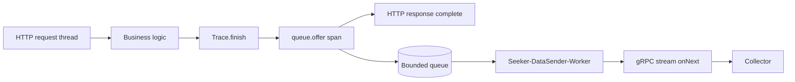

# 동기 전송 병목과 비동기 gRPC 전송 선택 이유

## 결론

`seeker-agent`에서 동기 collector 전송 대신 gRPC 기반 비동기 전송을 선택한 이유는 사용자 요청 처리 흐름과 관측 데이터 전송 흐름을 분리하기 위해서다.

APM agent는 대상 애플리케이션 안에서 동작한다. 따라서 agent의 collector 전송 지연이 사용자 API latency로 전파되면 안 된다. 기존 동기 방식은 요청 종료 시점에 collector 응답 또는 timeout을 기다리는 구조라 collector 상태가 곧 애플리케이션 응답 시간에 영향을 준다.

현재 구조는 요청 스레드가 span을 bounded queue에 넣고 바로 빠져나오며, 별도 daemon sender worker가 gRPC stream으로 collector에 전송한다.

## 기존 동기 방식의 문제

기존 동기 전송 흐름은 다음과 같이 이해할 수 있다.

```text
HTTP Request Thread
  -> Controller/Service/JDBC 처리
  -> Trace.finish()
  -> Collector 전송
  -> Collector 응답 또는 timeout 대기
  -> HTTP Response 완료
```

이 구조의 핵심 문제는 request thread가 collector network I/O까지 책임진다는 점이다.

Collector는 외부 시스템이다. 외부 시스템은 다음 이유로 언제든 느려질 수 있다.

- network latency
- collector overload
- collector GC pause
- collector restart
- connection 문제
- backend 저장소 지연

동기 방식에서는 이런 문제가 그대로 business thread 대기 시간으로 들어온다.

장애 전파 흐름:

```text
Collector 지연
  -> trace 전송 지연
  -> request thread 대기
  -> Tomcat worker thread 점유 증가
  -> 애플리케이션 처리량 감소
  -> 요청 대기열 증가
  -> 전체 latency 악화
```

APM agent의 목적은 관측이다. 관측 도구가 사용자 요청의 새로운 병목이 되면 설계 목표와 충돌한다.

## 개선 후 비동기 gRPC 방식

현재 구조는 request path에서 collector I/O를 제거한다.

```text
HTTP Request Thread
  -> Controller/Service/JDBC 처리
  -> Trace.finish()
  -> AsyncSpanDispatcher.send(span)
  -> queue.offer(span)
  -> HTTP Response 완료

Seeker-DataSender-Worker
  -> queue.take()
  -> GrpcSpanTransport.send(span)
  -> gRPC stream onNext()
```

Mermaid로 보면 다음과 같다.



핵심 변화:

```text
Before: 요청 스레드가 collector 전송까지 수행
After : 요청 스레드는 queue offer까지만 수행, collector 전송은 worker thread가 수행
```

## 비교 표

| 항목 | 동기 collector 전송 | 비동기 gRPC 전송 |
| --- | --- | --- |
| request thread 역할 | business logic + collector I/O | business logic + queue offer |
| collector 지연 영향 | 요청 latency에 직접 반영 | sender worker 쪽으로 격리 |
| 장애 전파 | collector 장애가 thread 점유로 전파 | 관측 데이터 손실/전송 실패로 제한 |
| 처리량 병목 | application과 collector가 강하게 결합 | request 처리량과 전송 처리량을 분리 |
| 네트워크 비용 | 요청마다 전송 호출 비용 발생 | stream을 열고 `onNext`로 연속 전송 |
| 메모리 제어 | 대기 위치가 request thread | bounded queue로 상한 설정 |
| 구현 복잡도 | 단순 | queue, worker, stream lifecycle 필요 |
| 유실 가능성 | 상대적으로 낮지만 요청 지연 큼 | queue overflow/종료 시 유실 가능 |

## 왜 gRPC인가

gRPC를 선택한 이유는 단순히 "빠르다"보다 다음 구조적 장점 때문이다.

1. 지속적인 관측 이벤트 전송에 stream 모델이 잘 맞는다.
2. protobuf 기반 schema를 통해 agent와 collector 사이의 메시지 계약을 명확히 할 수 있다.
3. HTTP 요청을 매번 새로 보내는 방식보다 반복 전송 overhead를 줄일 수 있다.
4. trace, metric, log 같은 이벤트를 같은 collector service 계열로 보낼 수 있다.
5. channel은 공유하고 stream은 분리하는 구조를 만들 수 있다.

현재 seeker-agent에서는 `GrpcChannelHolder`가 하나의 `ManagedChannel`을 만들고, span과 metric sender가 같은 channel을 공유하되 자기 stream을 따로 연다.

```text
GrpcChannelHolder
  ManagedChannel
    -> GrpcSpanTransport stream
    -> GrpcMetricSender stream
    -> GrpcLogTransport stream
```

## bounded queue의 의미

비동기 전송이라고 해서 무한히 메모리에 쌓으면 안 된다. Collector가 느린 상태에서 span을 계속 쌓으면 agent가 대상 애플리케이션 메모리를 잡아먹는다.

그래서 seeker-agent는 bounded queue를 사용한다.

```text
request thread -> bounded queue -> sender worker -> collector
```

bounded queue의 의미:

- collector가 느릴 때 request thread와 sender worker 사이에 완충 구간을 만든다.
- queue capacity로 agent가 사용할 수 있는 메모리 상한을 둔다.
- queue가 가득 차면 일부 관측 데이터를 버리는 선택을 한다.

APM agent에서는 보통 "애플리케이션을 느리게 만드는 것"보다 "일부 관측 데이터 유실"이 더 나은 선택이다. 관측 도구가 비즈니스 요청을 망가뜨리면 안 되기 때문이다.

## trade-off

비동기 gRPC 구조가 모든 문제를 자동으로 해결하는 것은 아니다.

장점:

- request latency 안정화
- collector 장애 영향 격리
- request thread 점유 시간 감소
- burst traffic 완충
- stream 기반 전송 overhead 감소

주의점:

- queue overflow 시 span이 drop될 수 있다.
- 현재 span drop count metric/log가 부족하다.
- gRPC stream 재연결에 backoff가 약하다.
- shutdown 시 queue flush 보장이 약할 수 있다.
- gRPC/Netty/Protobuf dependency 충돌을 막기 위한 shading/relocation이 필요하다.

## seeker 문서에 있는 성과 표현

`seeker-agent/docs/포트폴리오/apm-agent-portfolio-points.md`에는 다음 성과 중심 문장이 정리되어 있다.

```text
동기 HTTP 전송 구조를 queue 기반 비동기 gRPC streaming 구조로 개선한 결과,
평균 응답 시간을 69ms에서 43ms로 약 38% 단축했고
API 처리량을 2배 이상 향상시켰습니다.
```

이 수치는 포트폴리오 문서에 정리된 성과 표현이다. 나중에 면접이나 발표에서 사용하려면 테스트 조건도 함께 설명할 수 있어야 한다.

말할 때는 다음 흐름이 좋다.

1. 문제: collector 전송이 request latency에 포함됐다.
2. 원인: business thread와 collector I/O가 결합되어 있었다.
3. 해결: bounded queue + worker thread + gRPC stream으로 분리했다.
4. 효과: 평균 응답 시간 감소와 처리량 개선을 확인했다.
5. 한계: drop metric, retry/backoff, shutdown flush는 추가 개선 대상이다.

## 기억할 문장

> APM agent에서 가장 중요한 설계 원칙은 관측 데이터 수집이 사용자 요청 처리를 방해하지 않는 것이다.

> 동기 전송은 collector latency를 request latency로 전파하지만, 비동기 queue 기반 전송은 그 영향을 sender worker 쪽으로 격리한다.

> gRPC stream은 지속적으로 발생하는 span, metric, log 이벤트를 collector로 보내는 데 적합한 전송 모델이다.
