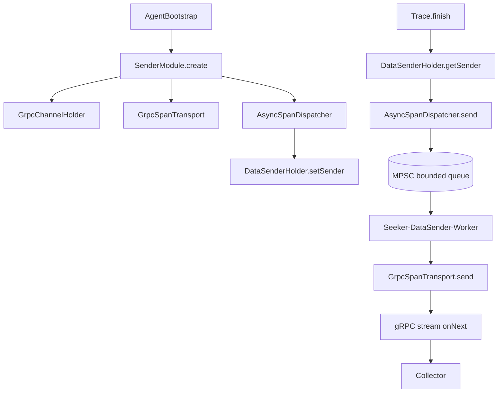

# 현재 seeker-agent 코드 기준 전송 구조

이 문서는 `seeker-agent` 실제 코드와 docs를 근거로 비동기 gRPC 전송 구조를 확인한다.

## 전체 구조



## 1. Trace.finish는 전송 구현을 직접 모른다

파일:

```text
/Users/gimseogchan/dev/seeker/seeker-agent/agent-core/src/main/java/com/seeker/agent/core/model/Trace.java
```

핵심 코드:

```java
public void finish() {
    this.span.finish();
    com.seeker.agent.core.sender.DataSenderHolder.getSender().send(this.span);
}
```

의미:

- `Trace.finish()`는 collector HTTP/gRPC 호출을 직접 하지 않는다.
- core는 `DataSenderHolder`에 들어 있는 sender에게 span을 넘길 뿐이다.
- 실제 전송 방식은 bootstrap 시점에 주입된 sender 구현체가 결정한다.

이 구조 덕분에 `agent-core`는 sender 구현체에 의존하지 않고, `agent-sender`가 실제 전송 책임을 가진다.

## 2. SenderModule이 gRPC transport와 async dispatcher를 조립한다

파일:

```text
/Users/gimseogchan/dev/seeker/seeker-agent/agent-sender/src/main/java/com/seeker/agent/sender/SenderModule.java
```

핵심 코드:

```java
private static final int DEFAULT_SPAN_QUEUE_CAPACITY = 1024 * 8;
```

```java
SpanTransport transport = debugEnabled
        ? new ConsoleSpanTransport()
        : new GrpcSpanTransport(
                grpcChannelHolder,
                agentInfo.getAgentName(),
                agentInfo.getAgentId());
DataSender dataSender = new AsyncSpanDispatcher(transport, DEFAULT_SPAN_QUEUE_CAPACITY);
DataSenderHolder.setSender(dataSender);
```

확인할 점:

- span queue capacity는 `8192`다.
- debug mode가 아니면 `GrpcSpanTransport`를 사용한다.
- 실제 `DataSender`는 `AsyncSpanDispatcher`다.
- `DataSenderHolder.setSender(dataSender)`로 core에서 호출할 sender를 주입한다.

즉 현재 runtime의 span 전송은 다음 형태다.

```text
DataSenderHolder
  -> AsyncSpanDispatcher
       -> GrpcSpanTransport
```

## 3. AsyncSpanDispatcher가 request thread와 sender worker를 분리한다

파일:

```text
/Users/gimseogchan/dev/seeker/seeker-agent/agent-sender/src/main/java/com/seeker/agent/sender/AsyncSpanDispatcher.java
```

핵심 필드:

```java
private final MpscBlockingConsumerArrayQueue<Span> queue;
private final SpanTransport transport;
private final Thread workerThread;
```

생성자:

```java
this.queue = new MpscBlockingConsumerArrayQueue<>(capacity);
this.workerThread = new Thread(this::run, "Seeker-DataSender-Worker");
this.workerThread.setDaemon(true);
this.workerThread.start();
```

request thread가 호출하는 `send()`:

```java
@Override
public void send(Span span) {
    if (!queue.offer(span)) {
        // Buffer overflow drop logic
    }
}
```

worker thread가 수행하는 전송:

```java
private void run() {
    while (running) {
        try {
            Span span = queue.take();
            transport.send(span);
        } catch (InterruptedException e) {
            Thread.currentThread().interrupt();
            break;
        } catch (Exception e) {
            System.err.println("[Seeker] BUG: SpanTransport가 예외를 throw함 - " + e);
            e.printStackTrace(System.err);
        }
    }
}
```

의미:

- 여러 request thread가 producer다.
- 단일 `Seeker-DataSender-Worker`가 consumer다.
- request thread는 queue offer까지만 수행한다.
- collector 전송은 worker thread에서 수행한다.
- queue가 가득 차면 현재 span은 drop될 수 있다.

여기서 사용하는 `MpscBlockingConsumerArrayQueue`는 이름 그대로 multi-producer single-consumer 구조다. request thread는 여러 개이고 sender worker는 하나인 현재 구조와 잘 맞는다.

## 4. GrpcSpanTransport는 async stub과 stream을 사용한다

파일:

```text
/Users/gimseogchan/dev/seeker/seeker-agent/agent-sender/src/main/java/com/seeker/agent/sender/GrpcSpanTransport.java
```

핵심 코드:

```java
this.stub = CollectorServiceGrpc.newStub(channelHolder.channel());
```

`newStub`은 gRPC async stub이다. blocking stub이 아니다.

stream lazy open:

```java
private synchronized void ensureStream() {
    if (requestObserver == null) {
        requestObserver = stub.collect(new StreamObserver<CollectResponse>() {
            ...
        });
    }
}
```

span 전송:

```java
requestObserver.onNext(converter.toDataMessage(span));
```

에러 처리:

```java
} catch (Exception e) {
    System.err.println("[Seeker] 데이터 전송 에러: " + e.getMessage());
    resetStream();
}
```

의미:

- HTTP 동기 호출이 아니다.
- gRPC async stub 기반 stream 전송이다.
- span은 `onNext()`로 stream에 push된다.
- 전송 중 예외가 발생해도 request thread로 전파되지 않는다.
- stream 오류 시 `requestObserver`를 `null`로 reset하고 다음 send에서 다시 연다.

## 5. gRPC channel은 공유하고 stream은 분리한다

파일:

```text
/Users/gimseogchan/dev/seeker/seeker-agent/agent-sender/src/main/java/com/seeker/agent/sender/GrpcChannelHolder.java
```

핵심 코드:

```java
this.channel = ManagedChannelBuilder.forAddress(host, port)
        .usePlaintext()
        .build();
```

`GrpcChannelHolder`의 역할:

- `ManagedChannel` 생성과 종료를 관리한다.
- `io.grpc` 의존성을 sender 모듈 내부로 감춘다.
- `channel()` 메서드를 package-private으로 둬 외부 모듈이 직접 접근하지 못하게 한다.

구조:

```text
GrpcChannelHolder
  ManagedChannel
    -> GrpcSpanTransport: span stream
    -> GrpcMetricSender: metric stream
    -> GrpcLogTransport: log stream
```

장점:

- channel 생성 비용을 줄인다.
- trace, metric, log 전송 경로를 stream 단위로 분리한다.
- sender 모듈 밖으로 gRPC 세부 구현이 새지 않는다.

## 6. metric과 log도 비동기/stream 설계를 따른다

Metric:

파일:

```text
/Users/gimseogchan/dev/seeker/seeker-agent/agent-sender/src/main/java/com/seeker/agent/sender/GrpcMetricSender.java
```

핵심:

- `CollectorServiceGrpc.newStub(...)` 사용
- lazy stream 생성
- metric snapshot list를 stream에 연속 `onNext`
- 예외를 throw하지 않고 stream reset

Log:

파일:

```text
/Users/gimseogchan/dev/seeker/seeker-agent/agent-sender/src/main/java/com/seeker/agent/sender/log/AsyncLogDispatcher.java
```

핵심:

- `MpscBlockingConsumerArrayQueue<LogRecord>` 사용
- appender path에서 network I/O가 일어나지 않도록 분리
- batch size와 flush interval 기준으로 전송
- `droppedCount`를 가지고 있어 log drop은 카운트 가능
- close 시 queue를 drain하고 best-effort flush

비교:

| 데이터 | 현재 전송 구조 | 특징 |
| --- | --- | --- |
| trace/span | bounded queue + single worker + gRPC stream | request thread에서 collector I/O 제거 |
| metric | scheduler + batch flush + gRPC stream | metric cycle 보호, batch 전송 |
| log | bounded queue + worker + batch flush + gRPC transport | appender path에서 network I/O 제거 |

## 7. 현재 코드 기준 한계

현재 구조는 동기 전송 병목을 제거했지만 운영 품질 측면에서 보강할 점이 있다.

| 한계 | 현재 상태 | 개선 방향 |
| --- | --- | --- |
| span queue overflow | `queue.offer` 실패 시 주석만 있고 count/log 부족 | dropped span counter, self metric 추가 |
| retry/backoff | stream reset 후 다음 send에서 재생성 | exponential backoff, circuit breaker 유사 정책 |
| shutdown flush | span queue drain 보장이 약함 | 제한 시간 내 best-effort drain/flush |
| 단일 worker | span consumer가 하나 | batch 전송 또는 worker 설정화 검토 |
| dependency isolation | gRPC/Netty/Protobuf 충돌 가능성 문서화됨 | shadow relocation 복구 및 검증 |
| plaintext channel | `usePlaintext()` 사용 | 운영 환경 TLS/mTLS 검토 |

## 8. 근거 문서

로컬 원본 문서:

- `/Users/gimseogchan/dev/seeker/seeker-agent/docs/troubleshooting-sync-collector-bottleneck.md`
- `/Users/gimseogchan/dev/seeker/seeker-agent/docs/포트폴리오/apm-agent-portfolio-points.md`
- `/Users/gimseogchan/dev/seeker/seeker-agent/docs/agent-open-source-analysis.md`
- `/Users/gimseogchan/dev/seeker/seeker-agent/docs/limitations.md`

로컬 원본 코드:

- `/Users/gimseogchan/dev/seeker/seeker-agent/agent-core/src/main/java/com/seeker/agent/core/model/Trace.java`
- `/Users/gimseogchan/dev/seeker/seeker-agent/agent-sender/src/main/java/com/seeker/agent/sender/SenderModule.java`
- `/Users/gimseogchan/dev/seeker/seeker-agent/agent-sender/src/main/java/com/seeker/agent/sender/AsyncSpanDispatcher.java`
- `/Users/gimseogchan/dev/seeker/seeker-agent/agent-sender/src/main/java/com/seeker/agent/sender/GrpcSpanTransport.java`
- `/Users/gimseogchan/dev/seeker/seeker-agent/agent-sender/src/main/java/com/seeker/agent/sender/GrpcChannelHolder.java`
- `/Users/gimseogchan/dev/seeker/seeker-agent/agent-sender/src/main/java/com/seeker/agent/sender/GrpcMetricSender.java`
- `/Users/gimseogchan/dev/seeker/seeker-agent/agent-sender/src/main/java/com/seeker/agent/sender/log/AsyncLogDispatcher.java`
