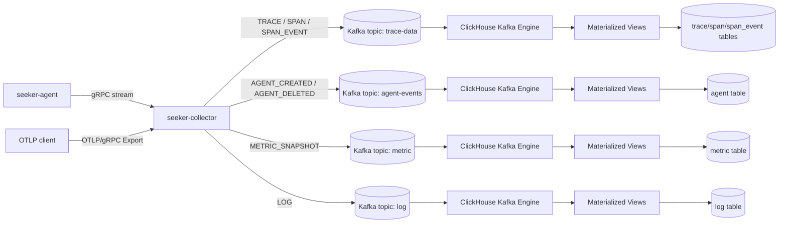

# seeker에서 Kafka를 사용하는 이유와 전체 흐름

## 결론

현재 seeker의 Kafka 사용 방식은 APM/observability 파이프라인에는 타당하다.

이유는 Kafka가 collector와 ClickHouse 사이에서 다음 역할을 하기 때문이다.

- collector와 저장소를 분리한다.
- 순간적으로 몰리는 trace, metric, log 이벤트를 buffer처럼 흡수한다.
- ClickHouse가 일시적으로 느려져도 collector가 바로 DB write에 묶이지 않게 한다.
- topic 단위로 trace, metric, log, agent lifecycle 데이터를 분리한다.
- 같은 traceId를 key로 사용해 같은 trace의 이벤트가 같은 partition에 들어가도록 설계할 수 있다.

단, 현재 구현은 운영 품질 관점에서는 보강할 점이 있다. 특히 Kafka publish를 fire-and-forget으로 처리하기 때문에 collector가 gRPC 응답을 성공으로 보내도 Kafka 저장은 실패할 수 있다.

## Kafka가 없는 구조

Kafka 없이 collector가 ClickHouse에 직접 저장한다면 흐름은 단순하다.

```text
seeker-agent
  -> gRPC
  -> seeker-collector
  -> ClickHouse insert
```

장점:

- 구조가 단순하다.
- 데이터가 저장됐는지 즉시 알기 쉽다.
- 중간 broker 운영이 필요 없다.

문제:

- ClickHouse 지연이 collector 처리 지연으로 바로 이어진다.
- 순간 트래픽이 커지면 collector와 ClickHouse가 동시에 압박을 받는다.
- collector 재시작/저장소 장애 시 데이터를 흡수할 완충 구간이 없다.
- trace, metric, log를 다른 속도와 보존 정책으로 처리하기 어렵다.

## Kafka를 둔 현재 구조

현재 seeker는 다음 구조에 가깝다.



이 구조에서 Kafka는 최종 저장소가 아니라 collector와 ClickHouse 사이의 durable event log다.

## topic 분리

현재 topic은 다음처럼 분리되어 있다.

| Topic | EventType | 용도 | Kafka key |
| --- | --- | --- | --- |
| `trace-data` | `TRACE`, `SPAN`, `SPAN_EVENT` | 요청 trace와 span detail | `traceId` |
| `agent-events` | `AGENT_CREATED`, `AGENT_DELETED` | agent lifecycle | `agentId` |
| `metric` | `METRIC_SNAPSHOT` | JVM/system metric snapshot | `agentId` |
| `log` | `LOG` | application log | `traceId` 우선, 없으면 `agentId` |

이 분리는 적절하다.

이유:

- trace와 log는 데이터 양과 조회 패턴이 다르다.
- metric은 snapshot 단위라 trace/span과 payload 구조가 다르다.
- agent lifecycle은 이벤트 양이 적고 보존/처리 중요도가 다르다.
- ClickHouse source table과 materialized view를 topic별로 단순하게 구성할 수 있다.

## EventEnvelope 구조

collector는 Kafka에 직접 domain row를 보내지 않고 envelope를 보낸다.

```java
public class EventEnvelope<T> {
    private EventType eventType;
    private Long timestamp;
    private T payload;
}
```

의미:

- `eventType`으로 하나의 topic 안에서도 이벤트 종류를 구분한다.
- `timestamp`로 collector가 이벤트를 발행한 시점을 남긴다.
- `payload`는 eventType마다 다른 구조를 가진다.

ClickHouse Kafka source table은 공통으로 다음 형태를 사용한다.

```sql
eventType LowCardinality(String),
timestamp Int64,
payload   String
```

그리고 Materialized View에서 `eventType`별로 분기해 `payload`를 `JSONExtract`로 파싱한다.

이 방식의 장점:

- Kafka source table schema가 단순하다.
- payload에 필드가 추가되어도 source table은 바꾸지 않아도 된다.
- `TRACE`, `SPAN`, `SPAN_EVENT`를 `trace-data` topic 하나로 받을 수 있다.

주의점:

- payload schema 검증이 약하다.
- 잘못된 JSON이나 타입 불일치가 ClickHouse 적재 실패로 이어질 수 있다.
- schema evolution 규칙을 문서화하지 않으면 producer/consumer가 어긋날 수 있다.

## Kafka key를 쓰는 이유

Kafka에서 같은 key를 가진 메시지는 같은 partition으로 들어간다.

seeker는 trace 데이터의 key로 `traceId`를 사용한다.

```text
TRACE(traceId=abc)      -> trace-data partition N
SPAN(traceId=abc)       -> trace-data partition N
SPAN_EVENT(traceId=abc) -> trace-data partition N
```

장점:

- 같은 trace에 속한 이벤트가 같은 partition으로 모인다.
- partition 안에서는 메시지 순서를 보존할 수 있다.
- trace 단위로 ClickHouse 적재 순서가 크게 흔들리는 것을 줄일 수 있다.

단, 현재 ClickHouse 저장 테이블은 trace, span, span_event가 분리되어 있고 materialized view도 분리되어 있으므로 "TRACE row가 반드시 SPAN row보다 먼저 저장되어야 한다" 같은 강한 의존을 두면 안 된다.

현재 구조에서는 cross-table ordering에 의존하지 않는 편이 맞다.

## 현재 방식은 맞게 쓰고 있는가

목적 기준으로는 맞게 쓰고 있다.

잘 맞는 점:

- collector와 ClickHouse를 분리했다.
- observability 이벤트를 append-only event stream으로 다룬다.
- topic을 데이터 성격별로 나눴다.
- trace/log는 traceId를 key로 사용해 관련 이벤트를 같은 partition에 묶는 방향이다.
- ClickHouse Kafka Engine + Materialized View로 비동기 적재한다.
- Kafka를 최종 조회 저장소가 아니라 ingest buffer로 사용한다.

주의할 점:

- Kafka publish 성공을 collector 응답과 강하게 묶지 않았다.
- producer reliability 설정이 명시적이지 않다.
- topic 생성/partition/retention 정책이 코드로 관리되지 않는다.
- ClickHouse Kafka Engine은 장애 상황에서 중복 적재 가능성을 고려해야 한다.
- poison message, DLQ, schema versioning이 아직 부족하다.

## 기억할 문장

> seeker에서 Kafka는 저장소가 아니라 collector와 ClickHouse 사이의 이벤트 로그이자 완충 계층이다.

> Kafka를 쓰는 핵심 이유는 빠른 조회가 아니라 ingest 안정성, 비동기 적재, 시스템 간 결합도 완화다.

> 현재 구조는 APM 이벤트 파이프라인에는 적합하지만, 운영 수준으로 가려면 유실/중복/순서/스키마/토픽 정책을 명시해야 한다.
