# Logback 로그가 collector로 넘어가지 않던 문제 - 2026-06-24

## 요약

`seeker-test-scenario`에서 `/api/test/log` 요청을 보내면 애플리케이션 콘솔에는 `INFO`, `WARN`, `ERROR` 로그가 정상 출력되었다. trace/span과 metric도 collector, Kafka 경로로 정상 전송되었다. 하지만 log 데이터만 collector와 Kafka `log` topic으로 넘어가지 않았다.

최종 원인은 Logback 계측 지점을 잘못 잡은 것이었다. 기존에는 `ch.qos.logback.core.UnsynchronizedAppenderBase#doAppend`를 계측했지만, 실제 로그 이벤트 수집에는 `ch.qos.logback.classic.Logger#callAppenders(ILoggingEvent)`를 잡는 것이 더 안정적이었다.

해결은 다음 두 가지가 핵심이었다.

- Byte Buddy `RETRANSFORMATION` 활성화
- Logback hook target을 `Logger#callAppenders`로 변경

## 문제상황

증상:

1. testserver의 `/api/test/log` 요청에서 로그는 콘솔에 정상 출력되었다.
2. trace/span, metric은 collector와 Kafka까지 정상 전송되었다.
3. log 데이터만 collector에 저장되지 않았다.
4. agent 쪽에서 Logback interceptor가 실제 로그 이벤트를 잡는 흔적이 없었다.

처음 의심한 지점:

- `seeker.profiler.log.enabled` 설정이 꺼져 있는가
- `seeker.profiler.log.logback.enabled` 설정이 꺼져 있는가
- debug mode 때문에 collector 전송이 비활성화됐는가
- testserver가 `.config` 파일을 제대로 읽지 못했는가
- collector의 `log` topic 또는 proto가 맞지 않는가
- Logback plugin이 아예 transform되지 않았는가

확인 결과 설정만의 문제는 아니었다. 핵심은 transform target이 실제 runtime logging path와 맞지 않았다는 점이었다.

## 전체 로그 파이프라인

정상 동작해야 하는 흐름은 다음과 같다.

```mermaid
flowchart LR
    A[testserver logger.info/warn/error] --> B[Logback Logger.callAppenders]
    B --> C[LogbackAppenderInterceptor]
    C --> D[LogbackEventConverter]
    D --> E[LogRecord]
    E --> F[LogSenderHolder]
    F --> G[AsyncLogDispatcher]
    G --> H[GrpcLogTransport]
    H --> I[collector gRPC LOG_BATCH]
    I --> J[LogKafkaProducer]
    J --> K[(Kafka topic: log)]
    K --> L[ClickHouse kafka_log]
    L --> M[Materialized View mv_log]
    M --> N[(ClickHouse log table)]
```



이 문제에서는 앞쪽 구간인 `Logback Logger -> interceptor` 단계에서 이벤트가 잡히지 않았다.

## 시도방법

### 1. testserver 설정 확인

확인한 설정:

```text
seeker.profiler.debug.enabled=false
seeker.profiler.log.enabled=true
seeker.profiler.log.logback.enabled=true
```

의미:

- `debug.enabled=false`이면 console-only가 아니라 collector 전송 경로를 사용한다.
- `log.enabled=true`이어야 sender module에서 log sender가 초기화된다.
- `logback.enabled=true`이어야 Logback plugin이 설치된다.

### 2. `.config` 로딩 방식 확인

`run-all.sh` 또는 실행 스크립트에서 설정 파일을 잘못 넘기면 agent가 기대한 설정을 읽지 못할 수 있다.

특히 `spring.config.additional-location`과 agent 전용 config는 목적이 다르다. Spring Boot 설정과 `seeker.config` 로딩을 섞어서 보면 원인 파악이 꼬일 수 있다.

### 3. 기존 hook target 검증

처음 계측한 지점:

```text
ch.qos.logback.core.UnsynchronizedAppenderBase#doAppend
```

확인 결과:

- transform 자체는 보였다.
- 하지만 실제 요청 로그에서 interceptor hit가 확인되지 않았다.
- 즉 "클래스가 transform됐다"와 "실제 로그 이벤트 경로에서 hit됐다"는 다른 문제였다.

### 4. hook target 변경 후 검증

변경한 지점:

```text
ch.qos.logback.classic.Logger#callAppenders(ILoggingEvent)
```

검증 결과:

- 요청 로그에서 `LogbackInterceptor hit` 확인
- `converted=true` 확인
- `sent LogRecord` 확인
- Kafka `log` topic에서 실제 `LOG` envelope 확인

### 5. Kafka payload 확인

Kafka `log` topic에서 확인한 필드:

- `eventType=LOG`
- `loggerName`
- `traceId`
- `spanId`
- `mdc.requestId`
- `mdc.scenario`
- `mdc.component`
- `exceptionType`
- `exceptionMessage`
- `exceptionStacktrace`

이 단계에서 Logback 수집뿐 아니라 trace/log correlation과 MDC 수집까지 같이 검증했다.

## 해결방법

### 1. Byte Buddy retransformation 활성화

파일:

```text
/Users/gimseogchan/dev/seeker/seeker-agent/agent-instrument/src/main/java/com/seeker/agent/instrument/InstrumentEngine.java
```

현재 코드:

```java
AgentBuilder agentBuilder = new AgentBuilder.Default()
        .with(AgentBuilder.RedefinitionStrategy.RETRANSFORMATION)
        .ignore(StandardMatchers.ignoreClasses());
```

필요했던 이유:

- Logback class는 agent plugin이 설치되기 전에 이미 로드될 수 있다.
- 이미 로드된 class에는 일반 transform만으로 advice가 적용되지 않을 수 있다.
- `RETRANSFORMATION`을 켜면 이미 로드된 class도 다시 변환해 hook을 적용할 수 있다.

### 2. Logback 계측 타겟 변경

파일:

```text
/Users/gimseogchan/dev/seeker/seeker-agent/plugins/logback-plugin/src/main/java/com/seeker/agent/plugin/logback/LogbackPlugin.java
```

현재 코드:

```java
return agentBuilder
        .type(named("ch.qos.logback.classic.Logger"))
        .transform((builder, typeDescription, classLoader, module, pd) -> {
            String interceptorName = "LogbackAppenderInterceptor";
            InterceptorRegistry.register(interceptorName, new LogbackAppenderInterceptor(...));

            return new BaseTransformer(interceptorName, named("callAppenders"))
                    .transform(builder, typeDescription, classLoader, module, pd);
        });
```

변경 의미:

| 구분 | 기존 | 변경 |
| --- | --- | --- |
| class | `ch.qos.logback.core.UnsynchronizedAppenderBase` | `ch.qos.logback.classic.Logger` |
| method | `doAppend` | `callAppenders` |
| 문제 | transform은 되지만 실제 hit가 안 보임 | 실제 logging event path에서 hit 확인 |

### 3. Logback event 변환 로직 확인

파일:

```text
/Users/gimseogchan/dev/seeker/seeker-agent/plugins/logback-plugin/src/main/java/com/seeker/agent/plugin/logback/LogbackEventConverter.java
```

변환 로직에서 중요한 부분:

- agent 내부 logger 제외
- severity min level 필터
- `onlyTraced=true`이면 trace 없는 로그 drop
- 현재 trace가 있으면 `traceId`, `spanId`, `parentSpanId` 주입
- agent 정보가 있으면 `agentId`, `serviceName`, `agentGroup` 주입
- MDC key를 `mdc.` prefix로 attribute에 추가
- exception type/message/stacktrace 추가

핵심 코드 흐름:

```java
Trace trace = TraceContextHolder.getContext().currentTraceObject();
if (onlyTraced && trace == null) {
    return null;
}
```

이 때문에 부팅 로그처럼 trace context 밖에서 발생한 로그가 수집되지 않는 것은 정상이다.

### 4. sender 경로 확인

파일:

```text
/Users/gimseogchan/dev/seeker/seeker-agent/agent-sender/src/main/java/com/seeker/agent/sender/SenderModule.java
```

log sender 초기화:

```java
LogTransport transport = debugEnabled
        ? new ConsoleLogTransport()
        : new GrpcLogTransport(grpcChannelHolder);
logSender = new AsyncLogDispatcher(
        transport,
        profilerConfig.log().getQueueCapacity(),
        profilerConfig.log().getBatchSize(),
        profilerConfig.log().getFlushIntervalMs());
LogSenderHolder.setSender(logSender);
```

의미:

- debug mode면 console로 출력한다.
- debug mode가 아니면 gRPC로 collector에 보낸다.
- `AsyncLogDispatcher`가 bounded queue와 batch flush를 담당한다.

## 해결

최종적으로 다음이 확인되었다.

1. `/api/test/log` 요청에서 Logback interceptor가 hit되었다.
2. Logback event가 `LogRecord`로 변환되었다.
3. `onlyTraced=true` 조건에서 요청 컨텍스트 안의 로그는 `converted=true`가 되었다.
4. `AsyncLogDispatcher`를 통해 log batch가 gRPC로 collector에 전송되었다.
5. collector가 `LOG_BATCH`를 받아 `LogKafkaProducer`로 `log` topic에 발행했다.
6. Kafka `log` topic payload에서 trace correlation, MDC, exception 정보가 확인되었다.

즉 문제는 Kafka나 ClickHouse가 아니라 agent의 Logback hook 지점이었다.

## 개념 정리

### Logback 이벤트 흐름

Logback에서 애플리케이션 코드가 `logger.info(...)`를 호출하면 내부적으로 `ILoggingEvent`가 만들어지고 appender들로 전달된다.

이번 문제의 핵심은 "어느 지점을 계측해야 실제 `ILoggingEvent`를 안정적으로 잡을 수 있는가"였다.

비교:

| 지점 | 설명 | 이번 결과 |
| --- | --- | --- |
| `UnsynchronizedAppenderBase#doAppend` | appender 쪽 진입점 | transform은 보였지만 hit 확인 실패 |
| `Logger#callAppenders` | logger가 appender들에게 event를 넘기는 지점 | 실제 요청 로그에서 hit 확인 |

### Byte Buddy retransformation

Java agent는 JVM class loading 시점에 bytecode를 바꾼다. 그런데 어떤 라이브러리 class는 agent plugin 설치 전에 이미 로드될 수 있다.

이 경우 이미 로드된 class를 다시 변환할 수 있어야 한다. Byte Buddy의 `AgentBuilder.RedefinitionStrategy.RETRANSFORMATION`이 그 역할을 한다.

기억할 점:

> transform 로그가 보인다고 실제 runtime path에서 advice가 실행된다는 뜻은 아니다. class load 시점과 실제 호출 지점을 모두 확인해야 한다.

### onlyTraced 옵션

`onlyTraced=true`는 trace context가 있는 로그만 수집한다는 뜻이다.

장점:

- trace와 연결된 로그만 저장해 APM 화면에서 유용하다.
- 부팅 로그, background 로그, agent 내부 로그까지 모두 쌓이는 것을 줄인다.

주의:

- 부팅 로그는 trace가 없으므로 drop되는 것이 정상이다.
- "로그가 안 들어온다"를 판단할 때 trace 안에서 발생한 요청 로그인지 확인해야 한다.
- trace 없는 로그도 보고 싶으면 `seeker.profiler.log.only-traced=false`로 테스트해야 한다.

### MDC

MDC는 logging framework가 thread-local 형태로 들고 있는 context map이다. 요청 id, scenario, component 같은 값을 로그에 붙이는 데 자주 쓴다.

이번 검증에서는 Kafka payload에서 다음 값이 확인되었다.

```text
mdc.requestId
mdc.scenario
mdc.component
```

즉 단순 message뿐 아니라 운영 분석에 필요한 부가 context도 함께 수집된 것이다.

### 재귀 수집 방지

Logback interceptor 안에서 다시 로그를 남기면 그 로그가 다시 interceptor를 타면서 재귀 문제가 생길 수 있다.

현재 구현은 `LogCaptureGuard`로 재진입을 막는다.

```java
if (!LogCaptureGuard.enter()) {
    return;
}
```

이런 guard는 log pipeline에서 중요하다. 로그 수집기가 자기 로그를 다시 수집하면 무한 루프나 폭발적인 로그 증가가 생길 수 있다.

## 문제 해결 체크리스트

비슷한 문제가 다시 생기면 다음 순서로 확인한다.

1. `seeker.profiler.log.enabled=true`인지 확인한다.
2. `seeker.profiler.log.logback.enabled=true`인지 확인한다.
3. `debug.enabled=false`인지 확인한다. debug mode면 collector가 아니라 console transport다.
4. `onlyTraced=true`라면 trace 안에서 발생한 요청 로그로 테스트한다.
5. Logback class가 transform되는지 확인한다.
6. transform만 보지 말고 interceptor hit 로그가 있는지 확인한다.
7. `Logger#callAppenders` hook이 적용됐는지 확인한다.
8. `AsyncLogDispatcher`가 초기화됐는지 확인한다.
9. collector가 `LOG_BATCH`를 받는지 확인한다.
10. Kafka `log` topic에 `eventType=LOG` payload가 쌓이는지 확인한다.

## 남은 주의점

- `plugins/logback-plugin/README.md`에는 예전 `UnsynchronizedAppenderBase#doAppend` 설명이 남아 있다. 실제 구현은 `Logger#callAppenders`이므로 문서도 갱신하는 편이 좋다.
- 현재 Logback만 지원한다. Log4j2, JUL은 별도 plugin이 필요하다.
- async/reactive thread boundary를 넘는 로그는 trace context가 없을 수 있다.
- log queue overflow 시 drop count는 있지만, 운영에서 이 값을 self metric으로 노출하는 작업이 필요하다.
- collector의 `log` topic 생성, proto 동기화, ClickHouse `mv_log` 적재까지 end-to-end로 확인해야 한다.

## 참고 파일

- `/Users/gimseogchan/dev/seeker/seeker-agent/docs/포트폴리오/troubleshooting-logback-log-pipeline.md`
- `/Users/gimseogchan/dev/seeker/seeker-agent/plugins/logback-plugin/src/main/java/com/seeker/agent/plugin/logback/LogbackPlugin.java`
- `/Users/gimseogchan/dev/seeker/seeker-agent/plugins/logback-plugin/src/main/java/com/seeker/agent/plugin/logback/LogbackAppenderInterceptor.java`
- `/Users/gimseogchan/dev/seeker/seeker-agent/plugins/logback-plugin/src/main/java/com/seeker/agent/plugin/logback/LogbackEventConverter.java`
- `/Users/gimseogchan/dev/seeker/seeker-agent/agent-instrument/src/main/java/com/seeker/agent/instrument/InstrumentEngine.java`
- `/Users/gimseogchan/dev/seeker/seeker-agent/agent-sender/src/main/java/com/seeker/agent/sender/SenderModule.java`
- `/Users/gimseogchan/dev/seeker/seeker-agent/agent-sender/src/main/java/com/seeker/agent/sender/log/AsyncLogDispatcher.java`
